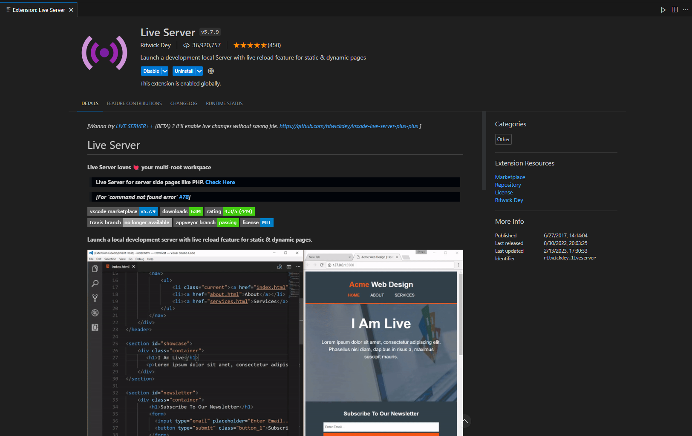
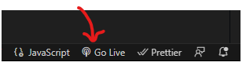
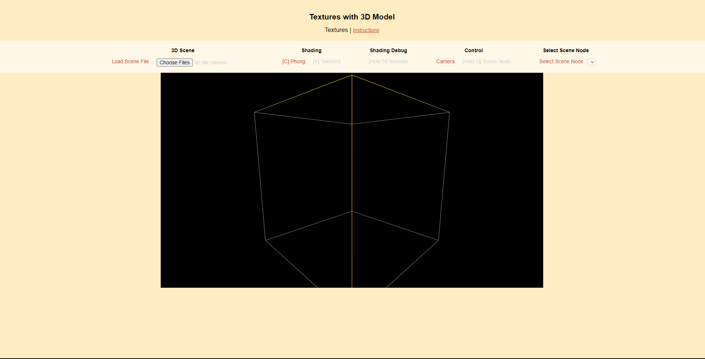
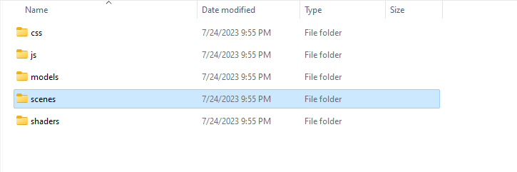
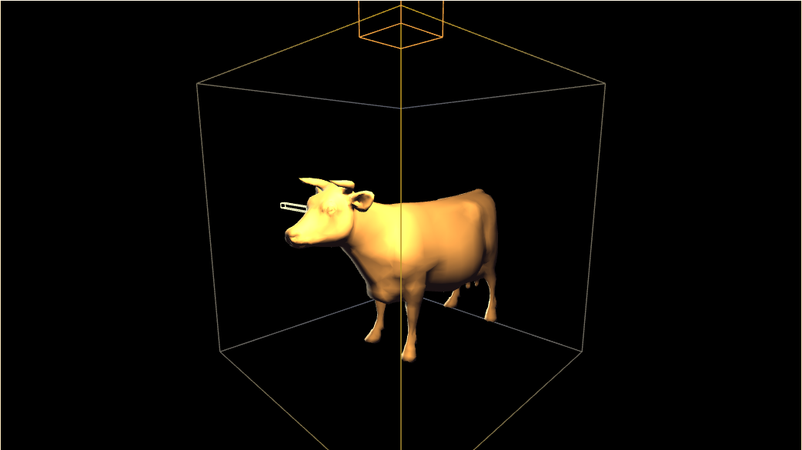
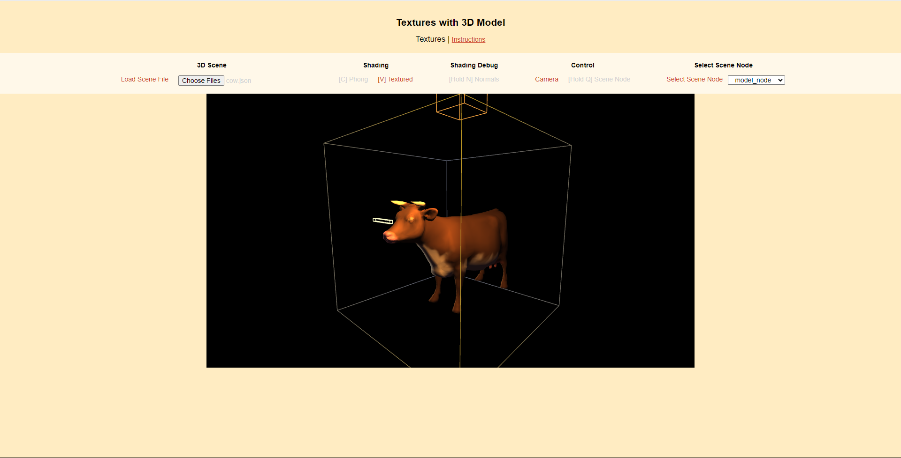
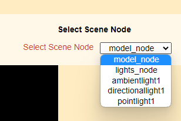
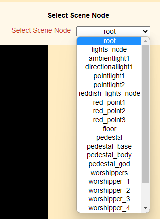
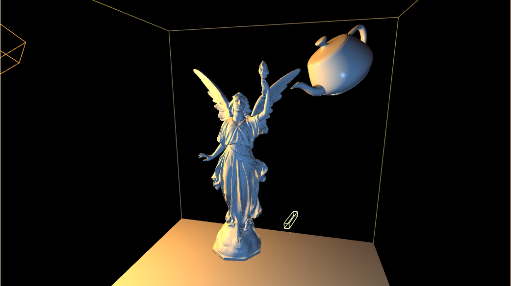

# 3D-Model-in-Webgl
---
A project in JavaScript that utilizes Live server extension in Visual Studio Code to output a 3D model that can be viewed with Phong Shading or Textured Shading under a light source. 

## Purpose 
The purpose of this project was to understand textures and shading of a 3D model. However, we were to utilize matrices to move the object around in any direction in the plane.

## About 
This project was the final project in ECS 175 Computer Graphics. Even though all the initialization and calculations were written by this author, most of the API and the models were provided by the Professor/TA of that class. This project uses files located in local computer which means using this program any user will be able to upload their own 3D model to view if they have the correct JSON file. However, test models will be provided in the code to  test and view how the 3D models work. 

## How to run this code
* Download Visual Studio Code [Download here](https://code.visualstudio.com/download)
* Download "Live Server" extension from your VS code extension page
* 
* Once downloaded, the button "Go Live" should show up in your bottom right corner of VS Code
* 
* Now clone this project or download it
* Once its downloaded, press the "Go Live" button
* This should open an HTML page that looks like this
* 
* Now press the "Choose Files" button under 3D Scene
* Locate your cloned/downloaded code then open the "scene" folder
* 
* Once opened it should show multiple titles of models that can be viewed
* For illustrative purposes, let's open the "cow.json" file
* 
* Now using a mouse, you can **left click** anywhere on the black box to move the **direction** of the box around
* You can **right click** anywhere on the black box to to **zoom** in or out by moving the mouse up or down
* You can click on the **scroll button** on the mouse to **move** the box around
* Let's move on to Shading
* The default Shading should be Phong Shading which can also be activated by pressing the **C** key
* You can also activate the textures by pressing the **V** key
* 
* You can check the Normals by pressing and holding the **N** key as written under the Shading Debug title
* 
* Before moving on to the Control title, let's look at the next one after that
* Under the Select Scene Node, you can choose the node you want to move around specifically
* 
* For test purposes, let's pick the light node
* Now looking under the Control title, we can see that by pressing and holding **Q** key we can move the scene node which currently should be the light node
* By holding Q key and then left clicking we can move the direction of the light node around (we can see that the shading by the light changes as you move the mouse around)
* By holding Q key and then right clicking we can move the light node closer or further
* By holding Q key and then clicking the scroll button on the mouse we can move the light node around
* We can do this to any of the object named under the Select Scene Node
* Different files may have different amount of objects to move around or see textures of
* 
* Now have fun checking all the objects textures and their lighting
* 

